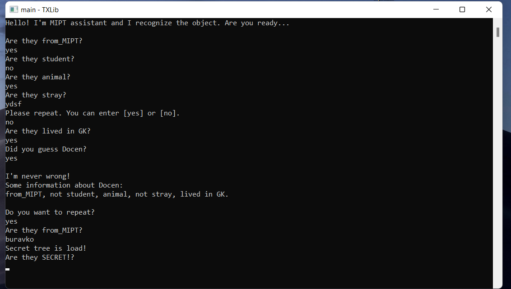

# Akinator - MIPT assistant 
#### My own small voice assistant & friend who doesn't let me get bored. He can help you find a person at Phystech.
#### You may say it sounds great, but I suggest you try it...
#### Real binary tree with music and a voice assistant.
#### A collaborate with DED32, best proger in the wild west and Russia.
#### Some information about this [library](http://storage.ded32.net.ru/Lib/TX/TXUpdate/Doc/HTML.ru/) or [GitHub version](https://github.com/ded32/TXLib). 
#### There is ``.exe`` for ``Windows``.
## Content:
- [The structure of the tree](#the-structure-of-the-tree)
- [Data storage format](#data-storage-format)
- [What can I do?](#what-can-i-do)
	- [Dialogue](#dialogue) 
	- [Mistakes](#mistakes) 	
- [Secret branch](#secret-branch)
- [Data encryption of SB](#data-encryption-of-sb)
	- [Hash](#this-is-the-hash-of-secret-branch)

### The structure of the tree

**The green arrow means the answer is yes.**

**The red arrow - no.**

**The end of each branch is the search object.**

>[Back to Content](#content)

### Data storage format
```
{ stray 
   { lived in GK 
       { Poltorashka }
       { Docen }
   }
   { black 
       { Bobic } 
       { Lord }  
   }
}
```

>[Back to Content](#content)
### What can I do?

#### Dialogue 
```
Hello! I'm MIPT assistant and I recognize the object. Are you ready...

Are they from_MIPT?
yes
Are they student?
no
Are they animal?
yes
Are they stray?
ydsf
Please repeat. You can enter [yes] or [no].
no
Are they lived in GK?
yes
Did you guess Docen?
yes

I'm never wrong!
Some information about Docen:
from_MIPT, not student, animal, not stray, lived in GK.

Do you want to repeat?
yes
```

#### Mistakes
**If you made a mistake, the system will offer a correction option.**
```
Are they stray?
ydsf
Please repeat. You can enter [yes] or [no].
```

>[Back to Content](#content)

### Secret branch
**At the top of the tree you can load secret subtree.**

```
Are they from_MIPT?
{password word}
Secret tree is load!
Are they SECRET!?
yes
Are they relatives?
no
Did you guess friends of my town?
yes

I'm never wrong!
Some information about friends of my town:
from_MIPT, SECRET!, not relatives.

Do you want to repeat?
no
I am formating your disk! See you soon!
```

>[Back to Content](#content)

### Data encryption of SB
**The secret branch is not loaded until your request. Therefore, after your command, decryption and embedding into the existing tree takes place. After the program ends, the secret branch will be updated and overwritten in encrypted form, if it has changed.**
- - -
#### This is the hash of secret branch
```
3A 1A 29 0D:20 00 35 1D|2A 0E 3C 5D:11 5A 3B 5A
3B 01 60 47:74 5C 78 57|72 40 21 0F:28 49 65 5D
3C 09 27 11:3E 5F 63 2F|64 05 64 05:3F 5E 72 52
7D 1C 50 1B:7A 1B 7A 1B|7A 1B 7A 40:21 07 34 14
3B 1E 32 1C:29 00 24 17|76 4A 06 4D:2C 4D 2C 4D
2C 4D 2C 16:77 51 62 42|6D 48 6F 4F:7A 53 77 44
25 19 55 1E:7F 1E 7F 43|0F 44 78
```

>[Back to Content](#content)

## ©Copyright
<p align="center">
	
	
<p>
